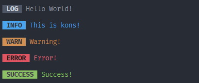

# kons

[](https://www.npmjs.com/package/kons)

An elegant console logger.

## Features

- Tiny (Minified + Gzipped ≈ 0.1kB). Beautiful. Easy to use.
- Customizable.
- TypeScript type declarations included.
- `NO_COLOR` friendly.

## Installation

```console
# NPM
$ npm install kons -S

# Yarn
$ yarn add kons

# PNPM
$ pnpm add kons
```

## Usage

```ts
import { error, info, log, success, warn } from "kons";

log("Hello World!");
info("This is kons!");
warn("Warning!");
error("Error!");
success("Success!");
```

Output:



### Advanced Usage

```ts
import { createFormatter } from "kons";

// Parameter 1: Log type
// Parameter 2: Log background color, see [picocolors](https://npmjs.com/package/picocolors) for available colors
// Parameter 3?: Log options, see types for more information
const myLog = createFormatter("myLog", "cyan", { target: console.info, textColor: "green" });
```

## License

[MIT](./LICENSE) License © 2022 [Ray](https://github.com/so1ve)
